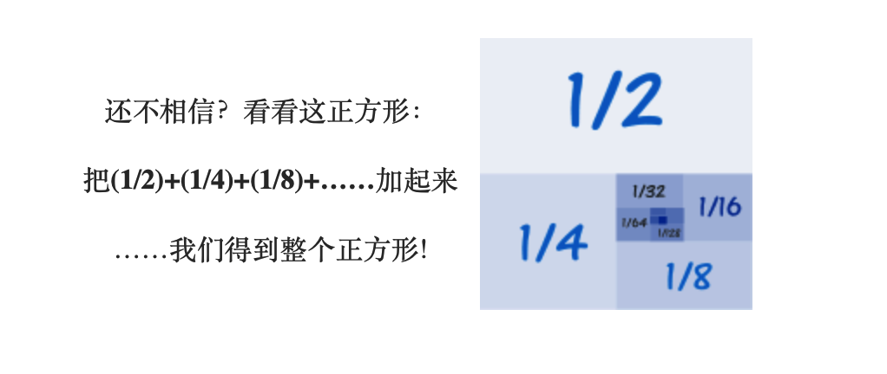

[TOC]
# 数列求和
## 等差数列
假设  
* 首项为: a
* 公差为: d 
* 下面得例子中 a = 1, d = 3
  

1,4,7,10,13...X~n~  = 1  + 3(N-1)  

通用: X~n~  = a  + d(N-1)  
等差数列所有项相加得和 = (N/2)*(2a + (n-1)d)  

## 等比数列
假设  
* 首项为:a
* 公比为:r
* 例子1, a = 1, r = 2
1,2,4,8,16,32,64....X~n~  = 1*2^(n-1)^  
* 例子2, a = 1, r = 1/2
1,1/2,1/4,1/8,1/16....X~n~  = 1*(1/2)^(n-1)^  

 通用: X~n~  = a * r^(n-1)^    
 等比数列所有项相加得和 = a((1-r^n^)/(1-r))   

### 无穷等比数列
如果0<r<1, 在n趋近于无穷大得时候, r^n^得值会趋近于0,  则等比数列所有项相加得和 = a(1/(1-r)) .
因此例子2中当n趋近无穷大得时候,  数列得和为 1.  

[数学乐](https://www.shuxuele.com/search/search.html?query=等差数列&submit=&search=1#ff)