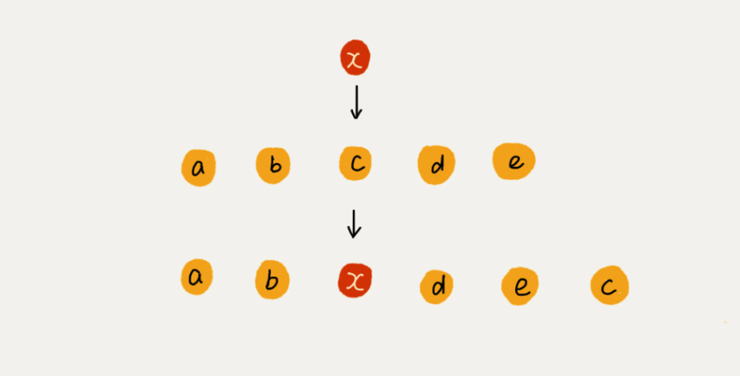

[TOC]

# 数组

## 数组的定义
数组（Array）是一种线性表数据结构。它用一组连续的内存空间，来存储一组具有相同类型的数据。  

* 线性表:  线性表就是数据排成一条线一样的结构, 每个数据最多只有前后俩个方向. 代表的数据结构有 `数组`, `链表`,`队列`,`栈`.
* 连续: 在数据存储的时候表现为, 占有内存中连续的内存
* 相同数据类型:  数组中保存的数据需要是相同的数据类型

## 数组的增删查
### 数组的杀手锏 -- 随机访问-- O(1)
得益于 `连续的内存空间`和`相同的数据类型` 让数组可以做到 `随机访问`.  

```C
a[i]_address = base_address + i * data_type_size
//a[i]_address 数组中的任意位置地址
//base_address为数组首位地址
//data_type_size 数据类型在改计算机中所占用的字节, 例如 int 在32位机型下 是4字节.
```

### 低效的插入和删除
同样也是由于 `连续的内存空间` 数组的插入和删除很低效.  

在数组的开头和结尾 插入和删除 可以做到O(1), 但是这种概率很低.   
如果在数组的中间做插入和删除操作, 那么需要依次改变紧随其后的数据.此时的平均时间复杂度是O(n).  

#### 高效的插入--O(1)
在不需要维持数组原来顺序的情况下, 插入数据可以做到时间复杂度O(1).   
a[10]中存储了如下 5 个元素：a，b，c，d，e。现在需要插入 x 到第3个位置


#### 高效的删除
假设 a[10]中存储了 8 个元素：a，b，c，d，e，f，g，h。现在，我们要依次删除 a，b，c 三个元素。
为了避免，d，e，f，g，h 被移动三次, 我们可以先记录下已经删除的数据. 此时只是记录被删除的数据, 等到数组的空间不足的时候,才真正的做删除操作. 
`这不就是 JVM 标记清除垃圾回收算法的核心思想吗？`

### 什么时候使用容器, 什么时候使用数组
#### java中的容器ArrayList相较数组的区别
1. ArrayList 最大的优势就是可以将很多数组操作的细节封装起来.
2. 支持动态的扩容. 
    每次ArrayList在空间不足的时候, 会开辟一个原先空间的1.5倍大小的新内存, copy原数组到新空间. 所以时间复杂度为O(n), 为了提高效率, 最好可以提前指定ArrayList的大小.  
```java
public void add(int index,E e){
  checkBoundInclusive(index);//检查是否 越界
  modCount++;//操作的次数,此处可以不注意
  if (size == data.length)
  	ensureCapacity(size + 1)//保证数组的size是足够的,数组在初始化的时候会分配连续的内存空间,这个函数检查如果空间不足,这会开辟新的*2的内存空间, 将老数组copy过来
  if (index != size)
  //第1位,第2位: data, index  //原数组
  //第3位,第4位: data, index + 1 //原地copy原数组并且预留一个位置 
  //第5位: size -index//在copy的时候, 需要外后挪一位
  	System.arraycopy(data, index, data, index + 1, size -index);
  data[index] = e;
  size++;
}
```

#### 什么时候使用数组
1. Java ArrayList 无法存储基本类型. 比如 int , long 需要封装位 Integer. Long类而 Autoboxing、Unboxing 则有一定的性能消耗, 所以如果关注性能可以使用数组.
2. 如果数据大小事先已知，并且对数据的操作非常简单,可以使用数组
3. 表示多维数组时，用数组往往会更加直观

#### 总结
如果做业务开发 使用容器损失一丢丢性能, ，完全不会影响到系统整体的性能。
但如果你是做一些非常底层的开发，比如开发网络框架，性能的优化需要做到极致，这个时候数组.

##参考链接
[数据结构与算法之美 王争](https://time.geekbang.org/column/article/40961)