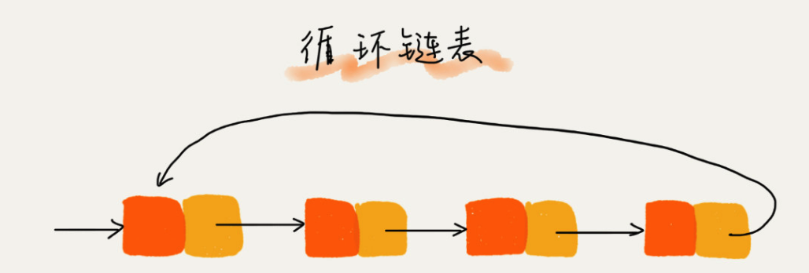

[TOC]

# 链表

## 链表的定义
链表（Linked list）是一种线性表，但是并不会按线性的顺序存储数据，而是在每一个节点里存到下一个节点的指针(Pointer)  

### 三种 常见链表
单向链表  

 --- 
 环形链表  

 --- 
 双向链表  


## 相较数组为什么使用链表
1. 链表的存储空间不需要连续, 所以如果内存中还有100MB的碎片内存, 任然可以开辟新的链存储100MB大小的链表数据, 数组在这种情况下就会申请内存空间失败.
2. 链表的删除和插入时间复杂度为O(1).相比较数组效率高很多.

NOTE: 链表访问指定元素时, 需要根据指针一个结点一个结点地依次遍历，直到找到相应的结点。  

## 链表的 增删查
### 链表的插入
链表的插入工作时间复杂度均为O(1)  
在链表中有一个p节点, 在p节点之后插入x节点  
```C
//以单链表为例
x->next = p->next;  // 将x的结点的next指针指向b结点；
p->next = x;  // 将p的next指针指向x结点；
```

### 链表的查
链表访问指定位置的平均时间复杂度为O(n),相较数组的随机访问, 链表访问的指定数据的速度要慢很多.  

### 链表的删除--相较单向链表为什么使用双向链表
#### 在实际操作中会遇到俩种情况
1. 删除特定的值
2. 删除指定指针指向的节点

就第一种情况单双链表的时间复杂度 均为O(n). 因为都需要从链表的第一个节点开始定位 特定的值  
就第二种情况单项节点需要先确认 `指定值` 的前驱节点, 做到这一点就需要从首节点开始依次查找. 平均时间复杂度为O(n), 而双向链表就快很多, 直接通过节点中的pre指针就可以访问到.  

#### 再分析一下链表的插入
1. 在指定元素之后插入
2. 在指定元素之前插入

就第一种情况, 单双链表的时间复杂度 均为O(1). 因为前驱节点已经得知  
就第二种情况, 类似于删除, 单链表无法得知前驱节点, 所以 平均时间复杂度为O(n), 而双向链表就快很多  

#### 再分析一下链表的查找
假设我们需要寻找指定的数值 p  
双向链表中保存的数据已经排好顺序,   我们可以记录上次查找的位置 p，每次查询时，根据要查找的值与 p 的大小关系，决定是往前还是往后查找，所以平均只需要查找一半的数据。时间复杂度为 O(logn).  

#### 双向链表的实际应用
Java中LinkedHashMap 这个容器。如果你深入研究 LinkedHashMap 的实现原理，就会发现其中就用到了双向链表这种数据结构。  

## 检查链表代码是否正确的边境额条件
1. 链表为空
2. 链表只包含一个结点
3. 链表包含俩个结点
4. 链表在处理头结点和尾结点的时候是否正常, 做增加,删除,修改的操作.

## 带头链表
### 添加结点
* 空链表状态下加入第一个节点, 代码如下
```C
if (head == nil) {
		head = first;
}
```

* 非空链表的状态下添加一个链表到尾部, 代码如下
```C
while (head->next != nil) {
		head = head->next;
}
head->next = new_node;
```

* 如果链表是带头链表的话, 创建一个头结点指向链表的第一个结点. 则无需考虑空链表添加第一个结点这种特殊情况, 下面的这个代码可以同时处理上面俩种情况
```C
while (guard->next != nil) {
		guard = guard->next;
}
guard->next = new_node;
```


### 删除结点
* 链表仅包含一个结点
```C
if (head->next == nil) {
		head == nil;
}
```

* 链表包含不止一个结点,  删除链表最后一个结点
```C
while (head->next != nil) {
		head = head->next;
}
head->next = nil;
```

* 如果链表是带头链表的话, 则无需考虑删除链表中唯一一个结点的情况
```C
while (guard->next != nil) {
		guard = guard->next;
}
guard->next = nil;
```

## 数组VS链表
  * 内存的使用是否非常苛刻
  * 在内存使用十分苛刻的时候适合选择数组, 链表会多消耗额外的存储空间用于指向next节点
  * 对链表频繁的删除,插入会造成内存空间的碎片化, JAVA语言可能会导致频繁的垃圾回收.
  * 数组由于使连续的空间, 可以借助CPU的缓存机制, 预计数组中的数据, 所以访问效率更高. 
  * 链表的内存不是连续存储的, 所以CPU缓存发挥的效用不如数组.


## CPU缓存
>在计算机系统中，CPU高速缓存（英语：CPU Cache，在本文中简称缓存）是用于减少处理器访问内存所需平均时间的部件。在金字塔式存储体系中它位于自顶向下的第二层，仅次于CPU寄存器。其容量远小于内存，但速度却可以接近处理器的频率。

>当处理器发出内存访问请求时，会先查看缓存内是否有请求数据。如果存在（命中），则不经访问内存直接返回该数据；如果不存在（失效），则要先把内存中的相应数据载入缓存，再将其返回处理器。

[CPU缓存L1,L2,L3](./CPU缓存.md)
[维基百科](https://zh.wikipedia.org/wiki/CPU%E7%BC%93%E5%AD%98)

## 参考链接
[数据结构与算法之美 王争](https://time.geekbang.org/column/article/41013)