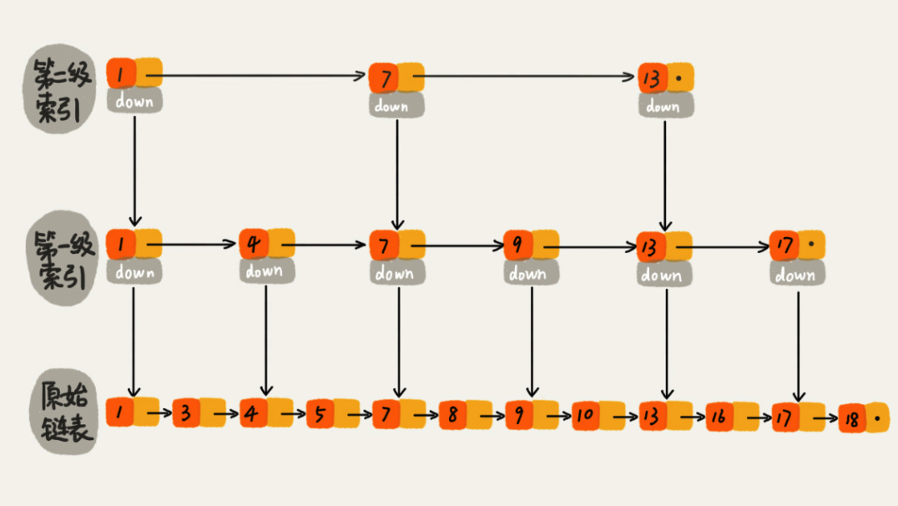
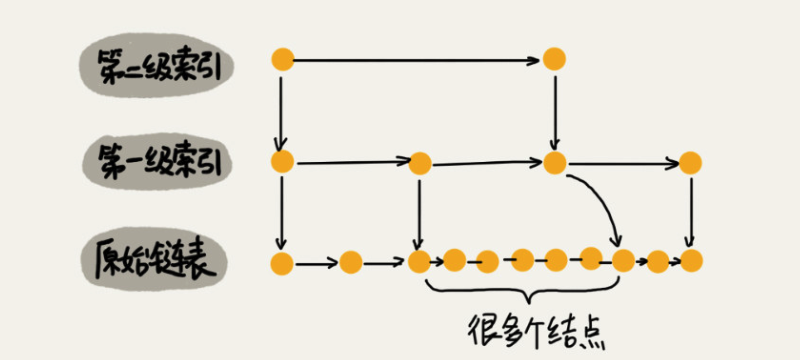

[TOC]

# 跳表
## 什么是跳表
* 跳表利用空间换时间得设计思路, 通过构建多级索引, 实现了链表得`"二分查找"`. 
* 跳表是一种 动态得数据结构, 多次得插入和删除操作会导致跳表退化为单链表, 所以跳表需要维护好索引和原始链表大小得平衡性, 可以通过一个随机函数, 来决定将这个结点插入到哪几级索引中. 比如随机函数返回值为K, 则可以将新插入得结点添加到第一层到第K层索引中.
* 跳表得查询, 删除, 插入得时间复杂度均为O(logN). 
* 跳表得空间复杂度O(N)

##  为什使用跳表
因为跳表他就是快
### 跳表查询得时间复杂度
**完整得跳表有多少层**  
**前提:**如果链表中包含N个元素, 完整得跳表顶层可能有3个,也有可能有2个. 假设顶层有2个结点. 跳表得索引层高为H层  
**推理: **第一层 : N/2, 第二层 N/4, 第三层: N/8....... 最顶层结点数 = 2 = N / 2 ^H^    
**得:** H = log2 ^n^ - 1  
在加上最底层得链表 H = log2 ^n^  
**查询得时间复杂度**  
要查找一个数字每一层最多遍历几个结点呢, 在这个例子中答案是3个结点, 可以对照上图得跳表结构, 尝试查询一个数字.   
查询得时间复杂度:O(3 * logN) -> O(logN)  

### 跳表得空间复杂度
**前提:**如果链表中包含N个元素, 俩个元素提取一个结点
**推理: **第一层 : N/2, 第二层 N/4, 第三层: N/8....... 最顶层结点数 = 2 
**得: ** n/2+n/4+n/8…+8+4+2, 运用等比公式计算发现答案近似于n
所以空间复杂度为O(N)
当然为了节省空间也可以每三个结点提取一个索引, 但是相交于原始链表中得对象, 索引中只保存指针, 所以消耗得空间是可以接收得. 

### 高效得动态插入和删除
#### 插入, 删除得时间复杂度
就单链表来说, 但是插入, 删除操作均是O(1)得复杂度  
已知 结点A, 删除结点A, 设计确认结点A得前驱结点, 所以时间复杂度实际为O(n)  
已知 结点A, 删除结点A得前一个结点, 设计确认结点A得前驱结点, 所以时间复杂度实际为O(n)  
已知 结点A, 删除结点A得后一个结点, O(1)  

已知 结点A, 在结点A之前插入一个新结点, 设计确认结点A得前驱结点, 所以时间复杂度实际为O(n)   
已知 结点A, 在结点A之前插入一个新结点,  O(1)  
**总结** 
* 跳表由于可以将查询操作得时间复杂度降低到O(logN), 进而提高了插入和删除操作得时间复杂度
* 通过上面得例子不难看出, 双向链表 效率高于单链表

#### 防止跳表退化为单链表
平凡得插入和删除, 在不对索引做维护得情况下, 跳表有可能退化为单链表, 比如在某一个区间内频繁得插入新结点, 烦请见图  

可以通过一个随机函数, 在每次插入得时候, 通过函数得返回值, 决定将该结点插入到几级索引中, 如果, 返回值为K, 则可以意味着将该结点插入到第一级和第K级索引中. 

## 为什么 Redis 要用跳表来实现有序集合，而不是红黑树？
Redis中得有序集合支持得核心操作
* 插入一个数据
* 删除一个数据
* 查找一个数据
* 按照区间查找数据
* 迭代输出有序序列。

跳表优于`红黑树`得地方:   
1. 跳表在照区间查找数据也可以做到O(logn) 的时间复杂度
2. 它可以通过改变索引构建策略，有效平衡执行效率和内存消耗

`红黑树`优于跳表得地方:   
很多编程语言得Map类型就是通过红黑树来实现得, 做业务开发得时候 可以直接拿来用.  
跳表则需要自己实现  

## 参考链接
[王争- 数据结构与算法之美](https://time.geekbang.org/column/article/42896)
