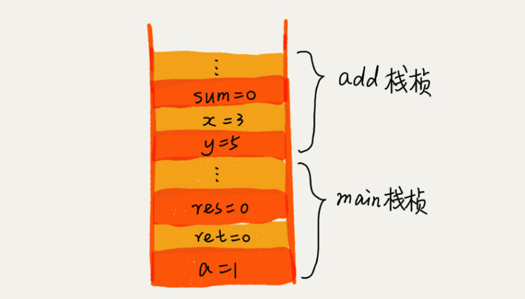
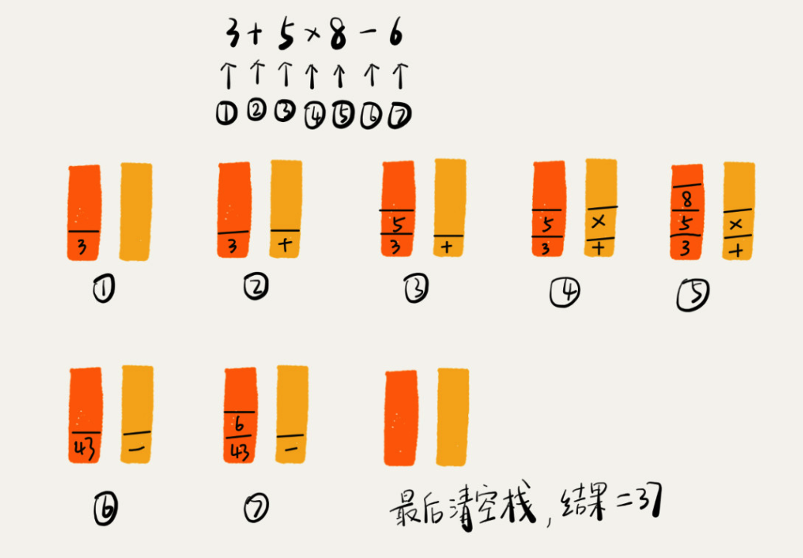

[TOC]

# 栈
## 什么是栈
说到栈 第一个想到的就是 `先进后出` , 想想一下洗碟子, 先洗好的碟子会放在下面, 后洗好的碟子会在上面, 而使用的时候, 会先从最上面的碟子拿.   

## 为什么要使用栈
栈是一种 `操作受限` 的线性表, 只允许在一端插入删除数据. 
**栈存在的意义是什么呢?**

1. 当某种数据集合只涉及一段插入和删除
2. 满足后进先出, 先进后出
此时就可以考虑使用栈这种数据结构了.

**栈和链表,数组对比:** 数组和链表暴露了太多的操作接口, 操作上的确灵活自由, 但是使用时比较不可控, 自然也就更容易出错. 

## 如何实现一个栈
**使用数组实现的栈称为 `顺序栈`**

```java
public class ArrayHeap {
    /** heap的最大数量 */
    private int heapMaxCount = -1;
    /** heap当前的数量 */
    private int count;
    /** 保存heap的数组 */
    private String[] heapArray;

    static int defaultCount = 5;
    //该类的创建方法
    public ArrayHeap(int count) {
        this.heapMaxCount = count;
        this.heapArray = new String[count];
        this.count = 0;
    }

    public ArrayHeap(){
        this.heapArray = new String[defaultCount];
        this.count = 0;
    }

    /** push */
    public boolean push(String item) {
        checkIfNeedextend();
        //如果没有满, 放在数组最后一位
        heapArray[count] = item;
        ++count;
        return true;
    }
    
    /** pop */
    public String pop() {
        if (count == 0) {
            return null;
        }

        checkIfNeedScale();

        String item = heapArray[count - 1];
        count--;
        return item;
    }

    /**扩大数组容量为原来俩倍大*/
    private void checkIfNeedextend() {
        if(heapArray.length == count) {
            
            String[] tempArray = new String[heapArray.length * 2];
            int count = Math.min(tempArray.length, heapArray.length);
            for (int i = 0;i < count; ++i) {
                tempArray[i] = heapArray[i];
            }
            heapArray = tempArray;
        }
    }

    /**缩小数组容量为原来俩一半*/
    private void checkIfNeedScale() {
        //容量太小了, 就不在做搬迁工作
        if (heapArray.length <= defaultCount) {
            return;
        }
        
        if(heapArray.length / 2 == count){
            
            String[] tempArray = new String[heapArray.length / 2];
            int count = Math.min(tempArray.length, heapArray.length);
            for (int i = 0;i < count; ++i) {
                tempArray[i] = heapArray[i];
            }
            heapArray = tempArray;
        }
    }
```
栈的push 和 pop方法时间复杂度均为 O(1)  

**使用链表实现的栈称为 `链式栈`**

```java
public class LinkedListHeap {
    /**创建头结点*/
    Node guardNode = new Node("");
    /**尾结点*/
    Node lastNode = guardNode;

    /**push*/
    public boolean push(String val) {
        if (val == null) {
            return false;
        }
        Node newNode = new Node(val);
        Node tempLast = lastNode;

        lastNode.next = newNode;
        lastNode = newNode;
        lastNode.pre = tempLast;

        return true;
    }

    /**pop*/
    public String pop() {
        if (lastNode == guardNode) {
            return null;
        }
        String data = lastNode.data;
        //删除最后一个结点
        lastNode.pre.next = null;
        lastNode = lastNode.pre;

        return data;
    }

    public void printAllNodes() {
        Node tempNode = guardNode;
        StringBuilder str = new StringBuilder();
        while (tempNode.next != null) {
            str.append(tempNode.next.data);
            tempNode = tempNode.next;
        }
        System.out.println(str.toString());
    }

    private class Node {
        private String data;
        private Node next;
        private Node pre;

        public Node(String data) {
            this.data = data;
        }

        public String getData() {
            return data;
        }

        public Node getNext() {
            return next;
        }

        public Node getPre() {
            return pre;
        }
    }
}
```

## 栈的实际应用 
### 栈在函数调用中的应用
操作系统给每个线程分配一块独立内存空间, 每进入一个函数, 就会将临时变量作为一个栈桢入栈, 当被调用函数执行弯沉, 返回之后, 将这个函数对应的栈桢出栈.   
**为什么函数调用要使用`栈`来保存临时变量呢 **

1. 函数调用符合先进后出, 后进先出的特性, 所以用栈这种数据结构来实现, 是最合适的. 
2. 从调用函数进入被调用函数, 数据所存在的作用域变了.  所以需要保存每次进入一个新的函数, 都是一个新的作用域. 在函数结束的时候, 被调用函数从栈顶弹出, 返回计算所得的答案, 正好回到调用函数的作用域内.
3. 以上功能而用栈实现则会很方便. 

**示例代码:**

```java
int main() {
   int a = 1; 
   int ret = 0;
   int res = 0;
   ret = add(3, 5);
   res = a + ret;
   printf("%d", res);
   reuturn 0;
}

int add(int x, int y) {
   int sum = 0;
   sum = x + y;
   return sum;
}
```
函数栈


### 栈在表达式求值中的应用
四则运算: 3+5*8-6  

*  小学老师告诉我们, 要先计算 乘法和除法, 再算加法和减法. 一个计算符号会被俩个数字包含. 
*  当你在做这个题目的时候, 你会从左到右遍历题目, 然后分辨哪些计算需要先算, 算完的值 , 在参与等级较低的操作符的计算. 这个时候你的大脑通过视觉保存了数据和操作, 并且识别出最先需要做的计算

所以综上所诉, 四则运算需要注意     
1. 保存数据和操作符
2. 可以做到最先计算等级高的操作

**编译器的栈实现原理:**

* 1号栈保存操作数, 2号栈保存操作符. 从左到右遍历表达式
* 当遇到数字,压入1号栈
* 当遇到操作符, 同栈顶操作符比较
 * 如果比栈顶操作符等级高, 则压入栈
 * 如果比栈顶操作等级低或者相等, 则该操作符占时搁置, 从栈顶取出等级高的操作符一个, 以及该操作符对应的俩个数字, 将计算完成的结果入栈
* 如此循环



### 栈在括号匹配中的应用
假设我们的括号表达式中包含三种括号, () {} []  
**合规的括号:** {[] ()[{}]}  [{()}([])]   [{()}]  
**不合规的括号:** {[}()]  
**如何判断括号是否合法:**  

* 用一个栈保存未匹配的括号, 从左到右依次扫描
* 如果是左括号则入栈
* 如果是右边括号则从栈顶取一个括号
 * 如果匹配则继续扫描
 * 如果不匹配则已经可以判断为不合规的表达式
* 如此直到扫描直到表达式尾部.

### 浏览器的前进、后退功能
可以使用俩个栈, 首次浏览的记录依次压入 1号栈, 点击返回按钮时, 从1号栈顶取出浏览记录, 依次压入2号栈. 在点击前进按钮则可以从2号栈顶取出浏览记录, 在放回1号栈.   
1号栈: a<-b<-c  
2号栈:   

点击返回俩次  
1号栈: a  
2号栈: c<-b  

点击一次前进  
1号栈: a<-b  
2号栈: c  

在b页面点击链接进入d页面, 则清空2号栈  
1号栈: a<-b<-d  
2号栈:   

### JVM 内存管理中的“堆栈”的概念
问: 那 JVM 里面的“栈”跟我们这里说的“栈”是不是一回事呢？  
答: 内存中堆栈和数据结构中的堆栈不是一个概念.  
内存中的堆栈 是真实的物理区.  
数据结构的堆栈 是抽象的数据结构.  

内存空间在逻辑上分为三部分: 1.代码区 2.静态数据区 3.动态数据区 (栈区 堆区)  
代码区: 存储方法体的二进制代码。  
静态数据区: 存储全局变量, 静态变量, 常量(final修饰的常量和 String常量), 系统自动分配管理和回收.  
栈区: 存储运行方法的形参, 局部变量, 返回值, 系统自动分配管理和回收.  
堆区: new一个对象的引用或地址存储在栈区, 对象的真实数据存储在堆区.  

## 参考网址
[栈-数据结构与算法之美](https://time.geekbang.org/column/article/41222)
