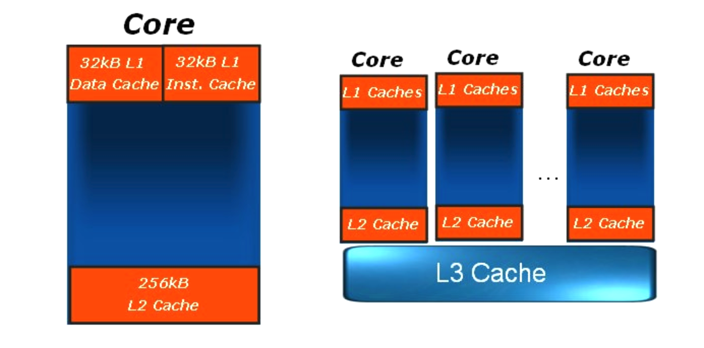

[TOC]

#CPU缓存会分为L1,L2,L3
##缓存
缓存就是数据交换的缓冲区 (称作 Cache). 缓存往往都是RAM (断电即掉的非永久存储). 他们的作用往往是帮助硬件更快的响应. 
电脑整机最大的缓存可以体现在内存条, 显卡的显存就是显卡芯片的缓存, 银盘上也有相对应的缓存, CPU最快的缓存(L1,L2,L3缓存等). 

##CPU缓存
`CPU缓存的定义`: CPU与内存之间的临时数据交换器, 它的出现是为了解决CPU运行处理速度与内存读写速度不匹配的矛盾-- 缓存的速度比内存的速度快很多.
`CPU缓存的位置`: 现阶段一般直接集成在CPU上
`CPU缓存的作用`: CPU往往需要重复处理**相同的数据**, 重复执行**相同的指令**, 如果这部分数据或指令可以在CPU缓存中找到, CPU就不需要从内存或硬盘中在读取数据,指令, 从而减少了整机响应的时间. 
`CPU缓存的速度`: 
1. CPU-L1缓存找到资料花费的时间为3个周期
2. CPU-L2缓存找到资料花费的时间为10个周期
3. CPU-L3缓存找到资料花费的时间为50个周期
4. 内存中找到所需资料花费的时间为几百个周期

##三级缓存
三级缓存包括, L1 一级缓存, L2 二级缓存, L3 三级缓存, 都是集成在CPU内的缓存. 
###一级缓存
一级缓存这个名称出现应该是在Intel公司Pentium处理器时代, 当时已经开始把缓分类, 将CPU内部集成的CPU缓存称为 `一级缓存` , 在CPU外部主板上的缓存称为 `二级缓存`
一级缓存由 `一级数据缓存 L1d` 和 `一级指令缓存 L1i` 构成. 数据和指令分开的一级缓存解决了 CPU多核心、多线程争用缓存造成的冲突, 一般L1d和L1i具有相同的容量. 

###二级缓存
L2缓存 实际上是L1一级缓存跟主内存之间的缓存器. 
随着CPU工艺的发展, 二级缓存也集成进入CPU内部, 二级缓存的主要作用是当 CPU在L1中没有读取到所需的数据时, 会去二级缓存中继续寻找. 

* Intel Core Duo 采用共享缓存技术, 多核共享2M L2二级缓存
* AMD Athlon 64 X2处理器则是每个CPU核心都具备独立的二级缓存

###三级缓存
同理, L3即为L2与主内存之间的缓存器. 

L3三级缓存的出现其实对CPU性能提升呈一个爬坡曲线——L3从0到2M的情况CPU性能提升非常明显，L3从2M到6M提升可能就只有10%不到了，这是在近代CPU多核共享L3的情况下；当L3集成进CPU正式成为CPU内部缓存后，CPU处理数据时只有5%需要在内存中调用数据，进一步地减少了内存延迟，使系统的响应更为快速。

Intel [Nehalem](https://lwn.net/Articles/252125/) SmartCache 

##Locality (位置)
* **Principle of Locality:** Programs tend to use data and instructions with addresses near or equal to those they have used recently.

* **Temporal Locality:** Recently referenced items are likely to be referenced again in the near futrue.

* **Spatial Locality:** Items with nearby addresses tend to be referenced close together in time.  

L1的运行速度很快，但是它的数据容量很小，CPU能在L1里命中的概率大概在80%左右——日常使用的情况下；L2、L3的机制也类似如此，这样一来，CPU需要在内存中读取的数据大概为5%-10%，其余数据命中全部可以在L1、L2、L3中做到，大大减少了系统的响应时间，总的来说，所有CPU读取数据的顺序都是先缓存再内存

##参考连接
[参考连接](https://www.expreview.com/60872.html)