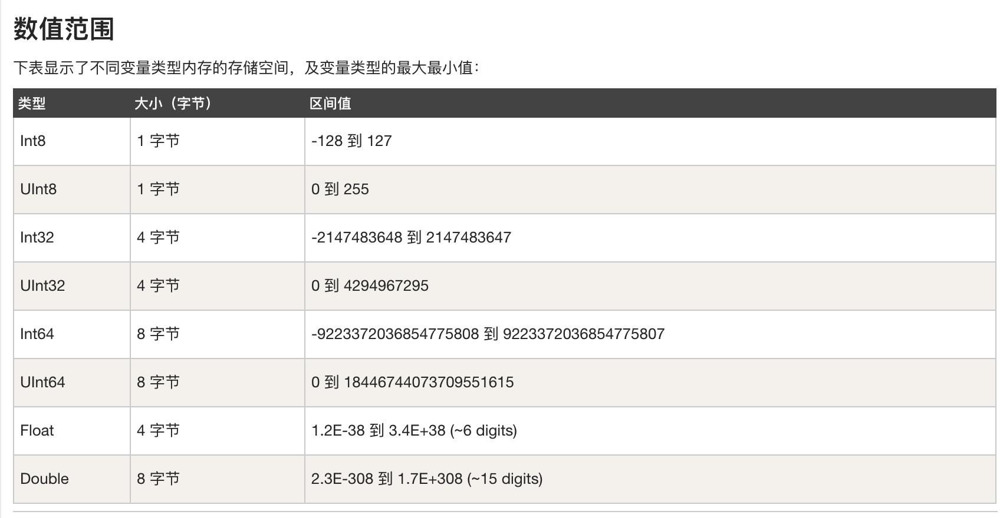

[TOC]

## 容量换算
计算机的储存及流量单位常用的有位(b) ,字节(Byte)，千道字节(KB)，兆(MB)，千兆(GB)，太字节(TB)，艾内字节(PB)。  
1B = 8b 1KB=1024B、1MB=1024KB、1GB=1024MB、1TB=1024GB  

## 在32位和64位环境下数据类型占用大小  
### java
C/C++ 中需要sizeof()方法因为不同数据类型在不同得机器上大小是不同得, 程序员必须知道数据得大小. 便于做内存管理.   

而java将内存管理得任务交给了jvm, windows下jvm有32位和64位俩个版本. 8中基本数据类型所占空间都是一样得, 但是new一个对象占用得空间就不一致了.  

| 对象 | 32位（byte） |  64位（byte） |
| :------------ |:---------------:| :-----:|
| new Object()  | 8 | 16  |
|  new Integer(1)  | 16  | 16 |
| new Short((short) 1) | 16 | 16 |
| new Boolean(true) | 16 | 16 |
| new Byte((byte) 0) | 16 | 16 |
| new Character((char) 1) | 16 | 16 |
| new Float(1) | 16 | 16 |
| new Double(1) | 16 | 24 |
| new Long(1) | 16 | 24 |
| new String() | 16 | 24 |
| new Object[0] | 16 | 16 |
| new Object[1] | 16 | 24 |
| new Object[2] | 24 | 24 |
| new Object[3] | 24 | 32 |
| new Object[4] | 32 | 32 |
| new Object[5] | 32 |40 |

| 基本数据类型 | 所占容量大小(B) |范围|默认值|
| :------------ |:-----:|:-----:|:-----:|
| byte | 1 |-128~127 | 0 |
| short | 2 |-32768 - 32768 | 0 |
| int |  4 | -2147483648-2147483648 | 0 |
|long | 8 | -9233372036854477808-9233372036854477808 | 0L|
|float | 4 | -3.40292347E+38-3.40292347E+38 | 0.0f|
|double | 8 | -1.79769313486231570E+308-1.79769313486231570E+308 | 0.0d|
|char | 2  | ‘ \u0000 - u\ffff ’  | ‘\u0000’|
|boolean | 1(bit) | true/false | false|

```java
public class Test {
    static boolean bool;
    static byte by;
    static char ch;
    static double d;
    static float f;
    static int i;
    static long l;
    static short sh;
    static String str;
 
    public static void main(String[] args) {
        System.out.println("Bool :" + bool);
        System.out.println("Byte :" + by);
        System.out.println("Character:" + ch);
        System.out.println("Double :" + d);
        System.out.println("Float :" + f);
        System.out.println("Integer :" + i);
        System.out.println("Long :" + l);
        System.out.println("Short :" + sh);
        System.out.println("String :" + str);
    }
}
```

```java
output:
Bool     :false
Byte     :0
Character:
Double   :0.0
Float    :0.0
Integer  :0
Long     :0
Short    :0
String   :null
```

Note:  
* 但是float得益于科学表达法所代表得数字比long要大, 所以在混和运算得时候long型会向 float型转化
* String (or any object), 初始之后得默认值位null
* 在Java中，引用类型的变量非常类似于C/C++的指针。引用类型指向一个对象，指向对象的变量是引用变量。这些变量在声明时被指定为一个特定的类型，比如 Employee、Puppy 等。变量一旦声明后，类型就不能被改变了。对象, 数组都是引用数据类型.

我们都说java是款平台得, 这里的平台说的是jvm, java可以在任意得jvm上运行, 但是jvm并不是跨操作系统得, jvm主要用C语言编写, Oracle公司开发了各个操作系统下得jvm, 这样就间接得实现了跨平台.  
[参考地址](https://blog.csdn.net/hong10086/article/details/79899961)  
[菜鸟教程](https://www.runoob.com/java/java-basic-datatypes.html)  

### swift

swift中并没隐式转换  
```
let a = 10
let b = 3.14

// 错误写法
// let c = a + b
// let c = a * b

// 正确写法
let c = Double(a) + b
let d = a + Int(b)
```

查看Int底层得代码可以得知 Int 并不是接本数据类型, 而是结构体  
```swift
public struct Int : FixedWidthInteger, SignedInteger {
......
}
```
[Swift和C混编](https://swift.gg/2016/12/13/swift-and-c-everything-you-need-to-know/)  
[菜鸟教程](https://www.runoob.com/swift/swift-data-types.html)  
