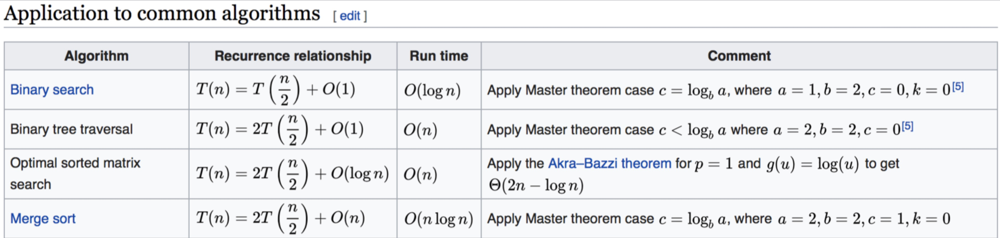

[TOC]
# 学习笔记

## 自顶向下
自顶向下得思考主要是基于我们已经知道得东西, 逐步拆分问题, 解决每一个小问题, 这样一个比较大的问题就得以解决.  

### 软件设计应该采用自顶向下还是自底向上的方法？  
>真正得风险不是在于采用了那中方法, 而是在于人们总是试图预先直到所有事情, 就像瀑布式思维这类设计.自定向下和自底向上都只是学习和知识排序得策略, 俩者只是不同得思维方式, 它们都非常有用.
>
自顶向下的思考主要是基于我们已经知道的东西。自顶向下就像逐步分拆问题，而每个问题就像一个内容未知的黑盒子。但分拆到一定程度，我们会陷入困境，这时候就必须转换到自底向上的视角，尝试发现我们不知道的东西。现在我们只是在开发软件的一小部分（它们可以成为参与者），最终它会成为一个更大的系统中的子系统，这是可以被认为是一种浮现式设计。

[Vernon 谈软件设计，到底是自顶向下还是自底向上](https://www.infoq.cn/article/BK-slZpJePA3NuQM7yEp)  

## 主定理

**参考连接** [主定理](https://zh.wikipedia.org/wiki/主定理)  

## 什么时候使用容器, 什么时候使用数组
### java中的容器ArrayList相较数组的区别
1. ArrayList 最大的优势就是可以将很多数组操作的细节封装起来.
2. 支持动态的扩容. 
    每次ArrayList在空间不足的时候, 会开辟一个原先空间的1.5倍大小的新内存, copy原数组到新空间. 所以时间复杂度为O(n), 为了提高效率, 最好可以提前指定ArrayList的大小.  
```java
public void add(int index,E e){
  checkBoundInclusive(index);//检查是否 越界
  modCount++;//操作的次数,此处可以不注意
  if (size == data.length)
  	ensureCapacity(size + 1)//保证数组的size是足够的,数组在初始化的时候会分配连续的内存空间,这个函数检查如果空间不足,这会开辟新的*2的内存空间, 将老数组copy过来
  if (index != size)
  //第1位,第2位: data, index  //原数组
  //第3位,第4位: data, index + 1 //原地copy原数组并且预留一个位置 
  //第5位: size -index//在copy的时候, 需要外后挪一位
  	System.arraycopy(data, index, data, index + 1, size -index);
  data[index] = e;
  size++;
}
```

### 什么时候使用数组
1. Java ArrayList 无法存储基本类型. 比如 int , long 需要封装位 Integer. Long类而 Autoboxing、Unboxing 则有一定的性能消耗, 所以如果关注性能可以使用数组.
2. 如果数据大小事先已知，并且对数据的操作非常简单,可以使用数组
3. 表示多维数组时，用数组往往会更加直观

### 总结
如果做业务开发 使用容器损失一丢丢性能, ，完全不会影响到系统整体的性能。
但如果你是做一些非常底层的开发，比如开发网络框架，性能的优化需要做到极致，这个时候数组.

## 相较数组为什么使用链表
1. 链表的存储空间不需要连续, 所以如果内存中还有100MB的碎片内存, 任然可以开辟新的链存储100MB大小的链表数据, 数组在这种情况下就会申请内存空间失败.
2. 链表的删除和插入时间复杂度为O(1).相比较数组效率高很多.

NOTE: 链表访问指定元素时, 需要根据指针一个结点一个结点地依次遍历，直到找到相应的结点。 
### 总结
  * 内存的使用是否非常苛刻
  * 在内存使用十分苛刻的时候适合选择数组, 链表会多消耗额外的存储空间用于指向next节点
  * 对链表频繁的删除,插入会造成内存空间的碎片化, JAVA语言可能会导致频繁的垃圾回收.
  * 数组由于使连续的空间, 可以借助CPU的缓存机制, 预计数组中的数据, 所以访问效率更高. 
  * 链表的内存不是连续存储的, 所以CPU缓存发挥的效用不如数组.
  * 如果不需要通过下标快速访问指定元素, 可以考虑使用链表

## 跳表
* 跳表利用空间换时间得设计思路, 通过构建多级索引, 实现了链表得`"二分查找"`. 
* 跳表是一种 动态得数据结构, 多次得插入和删除操作会导致跳表退化为单链表, 所以跳表需要维护好索引和原始链表大小得平衡性, 可以通过一个随机函数, 来决定将这个结点插入到哪几级索引中. 比如随机函数返回值为K, 则可以将新插入得结点添加到第一层到第K层索引中.
* 跳表得查询, 删除, 插入得时间复杂度均为O(logN). 
* 跳表得空间复杂度O(N)

## 课后作业
### 新的 API 改写 Deque 的代码
```java
ArrayDeque<String> deque = new ArrayDeque<String>();
deque.offerFirst("zore");

deque.offerFirst("first");
deque.offerFirst("second");
deque.offerFirst("third");
System.out.println(deque);

String peekFirstString = deque.peekFirst();
System.out.println(peekFirstString);
System.out.println(deque);

while (deque.size() > 1) {
    System.out.println(deque.pollFirst());
}
System.out.println(deque);

System.out.println("========");

deque.offerLast("first");
deque.offerLast("second");
deque.offerLast("third");
System.out.println(deque);

String peekFirstString_1 = deque.peekLast();
System.out.println(peekFirstString_1);
System.out.println(deque);

while (deque.size() > 1) {
    System.out.println(deque.pollLast());
}
System.out.println(deque);

System.out.println("========");

System.out.println(deque.pollLast());
System.out.println(deque);
```