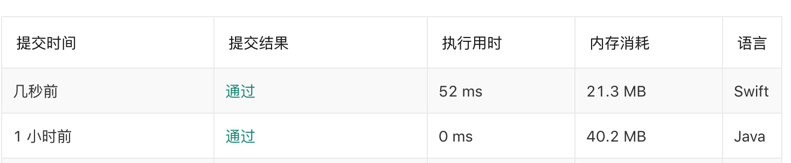

[TOC]

# Week01所思所问

##1.问题1:同样的解题思路,为什么swift语言得速度慢很多
java
```java
public void moveZeroes(int[] nums) {
    //i 用于遍历整个数组, 扫描到不为0得数, 直接赋值到j位置
    int j = 0;
    for(int i=0; i < nums.length; ++i) {
        if (nums[i] != 0) {
            nums[j++] = nums[i];
        }
    }
		
		//通过i已经遍历完了所有得元素, j之后得所有元素都为0
    while (j < nums.length) {
        nums[j++] = 0;
    }
}
```

swift
```swift
func moveZeroes(_ nums: inout [Int]) {
    var lastPostionNonZore : Int = 0;
    //i用于遍历整个数组
    for i in 0..<nums.count {
        if nums[i] != 0 {
            //lastPostionNonZore != i 说明到i为止,前面有0
            if lastPostionNonZore != i {
                nums[lastPostionNonZore] = nums[i]
                nums[i] = 0 
            }
            lastPostionNonZore += 1
        }
    }
}
```




##问题二: swift语言 [1] + [1,2,3]得底层实现

##