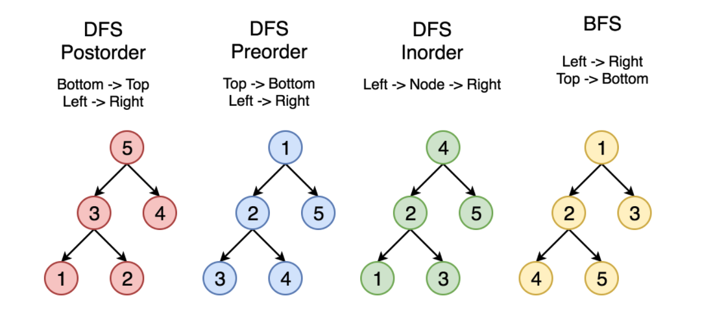

[TOC]

#  树
## 什么是树
森林里面的树, 和数据结构里面的树, 样子很像, 有组干和枝杈. 

```swift
    3        root 根节点
   / \
  9  20      20 相对于 15/7为父节点, 相对于3 为子节点, 相对于 9 为兄弟节点
    /  \
   15   7    9 相对于 7(或15) 为叔叔节点
             9 / 15 / 7 均为子节点
```
`高度`, 从叶子结点按0开始计算, 往上数依次+1  
`深度`, 从根结点按0开始计算, 往下数依次+1   
`层` , 从根结点按1开始计算, 往下数依次+1   

### 特殊的树
`二叉树`的每个节点最多有两个子节点，分别是左子节点和右子节点  
`完全二叉树`: 叶子节点都在最底下两层，最后一层的叶子节点都靠左排列，并且除了最后一层，其他层的节点个数都要达到最大
`满二叉树` (特殊的完全二叉树) :  叶子节点全都在最底层，除了叶子节点之外，每个节点都有左右两个子节点  

## 树的存储
**数组:** 数组适合存储, 完全二叉树  
```swift
     17        
   /    \
  9     20     
 / \   /  \
6  10 15   27    
```
array[1] = 17,  
array[2] = 9, array[3] = 20,  
array[4] = 6, array[5] = 10,array[6] = 15, array[7] = 27  
```
假设  index = 2
     左子节点 = index * 2
     右子节点 = index * 2 + 1
     父结点 = index / 2
```
从上面的例子不难看出 为什么数组适合保存 完全二叉树了吧, 也可以理解为什么 完全二叉树的最底层叶子结点需要靠左了吧, 这样存储的时候可以少浪费一些数组空间  

**链表:** 合适存储树, 但是无法完全发挥CPU的缓存效率, 多次插入,删除,造成内存空间碎片化, 所以完全二叉树推荐数组存储  

## 遍历函数
前中后, 标识着 root 什么时候输出
```C++
void preOrder(Node* root) {
  if (root == null) return;
  println(root); 
  preOrder(root->left);
  preOrder(root->right);
}

void inOrder(Node* root) {
  if (root == null) return;
  println(root); 
  print root // 此处为伪代码，表示打印root节点
  inOrder(root->right);
}

void postOrder(Node* root) {
  if (root == null) return;
  postOrder(root->left);
  postOrder(root->right);
  println(root); 
}
```
时间复杂度: O(N)
空间复杂度: O(N)

### 遍历函数图解


## 二叉查找树(有名: 二叉搜索树)
**二叉查找树, 要求在树种任意一个结点, 左子树结点的值都小于该结点值, 右子树结点的值都大于该结点值**  
### 查找
上代码
```java
public class BinarySearchTree {
		private Node root;
		public Node find(int data) {
				Node p = root;
				//实用迭代的方法
				while (p != null) {
						//data和目标节点对比, 小于目标结点,则继续在左子树查询
						if (data < p.data) p = p.left;
						//data和目标节点对比, 大于目标结点,则继续在右子树查询
						else if (data > p.data) p = p.right;
						else return p;
				}
				return null;
		}
}
```

### 插入
插入类似查找
```java
public void insert(int data) {
		if (root == null) { 
				root = new Node(data);
				return;
		}
		
		Node p = tree;
		while (p != null) {
				//data和目标节点对比, 小于目标结点, 如果目标的左边为空, 则直接插入
				if (data < p.data) {
						if (p.left == null) {
								p.left = new Node(data);
								return;
						}
						//否则, 继续在左子树寻找合适的位置
						p = p.left
				} else {
						//同理
						if (p.right == null) {
								p.right = new Node(data);
								return;
						}
						p = p.right
				} 
		}
}
```

### 插入的时候遇到值相等的数据了
解决办法一: 在遇到相同的时候, 使用支持动态扩容的数据结构, 将相同的数据保存为一个链表, 树的节点保存一个链表

解决办法二: 遍历的时候发现 等于正在对比的节点, 将这个要插入的数据当作大于节点的值来处理, 继续在对比节点的右子树中寻找适合位置。  
删除的时候, 遇到相等的值, 不能停止, 继续在右子树中查询, 直到叶子节点, 删除所有  

### 删除
```java
public void delete(int data) {
  Node p = root; // p指向要删除的节点，初始化指向根节点
  //先找到这个节点
  Node pp = null; // pp记录的是p的父节点
  while (p != null && p.data != data) {
    pp = p;
    if (data > p.data) p = p.right;
    else p = p.left;
  }
  if (p == null) return; // 没有找到

  // 要删除的节点有两个子节点
  if (p.left != null && p.right != null) { // 查找右子树中最小节点
    Node minP = p.right;
    Node minPP = p; // minPP表示minP的父节点
    while (minP.left != null) {
      minPP = minP;
      minP = minP.left;
    }
    p.data = minP.data; // 将minP的数据替换到p中
    p = minP; // 下面就变成了删除minP了
    pp = minPP;
  }

  // 删除节点是叶子节点或者仅有一个子节点
  Node child; // p的子节点
  if (p.left != null) child = p.left;
  else if (p.right != null) child = p.right;
  else child = null;

  if (pp == null) root = child; // 删除的是根节点
  else if (pp.left == p) pp.left = child;
  else pp.right = child;
}
```
> 二叉查找树的删除操作，还有个非常简单、取巧的方法，就是单纯将要删除的节点标记为“已删除”，但是并不真正从树中将这个节点去掉。这样原本删除的节点还需要存储在内存中，比较浪费内存空间，但是删除操作就变得简单了很多。而且，这种处理方法也并没有增加插入、查找操作代码实现的难度。

### 二叉树其他操作
1. 快速查找最大值 , 最小值
2. 中序遍历, 可以输出有序的数组序列

## 散列表 VS 二叉树
**二叉树优势**
1. 二叉树的中序遍历可以在时间复杂度为 O(N)的情况下输出`有序`的数据, 散列表需要, 先排序, 时间复杂度至少是O(N*logN)
2. 散列表为了解决 散列冲突, 会在装载因子越过阀值的时候, 做扩容操作, 性能不稳定, 一颗平衡的二叉树, 时间复杂度可以稳定在O(logN)
3. 因素一: 哈希函数的存在, 因素二:散列冲突的解决, 也会耗时, 比较常用的开发寻址法, 需要遍历对比key值, 链表法, 需要遍历链表对比key值, 由于这俩个因素查询的时间复杂度不一定比二叉树的O(logN)快, 
4. 由于 散列冲突, 还会浪费一些空间
5. 散列表的设计需要 考虑的因素太多了, 二叉树只需要考虑平衡性

## 平衡二叉树
对比散列表的时候, 提到了平衡二叉树.  因为二叉查找树在频繁的插入、删除等动态更新的情况下，极端情况会出现时间复杂度退化为O(N)的问题,  在二叉搜索树的基础上加上一个平衡因子<=1 ,就是平衡二叉树, 平衡二叉树让数据的插入, 删除, 查找时间复杂度更稳定

## 参考网址
[王争 -- 算法于数据之美](https://time.geekbang.org/column/article/68334)