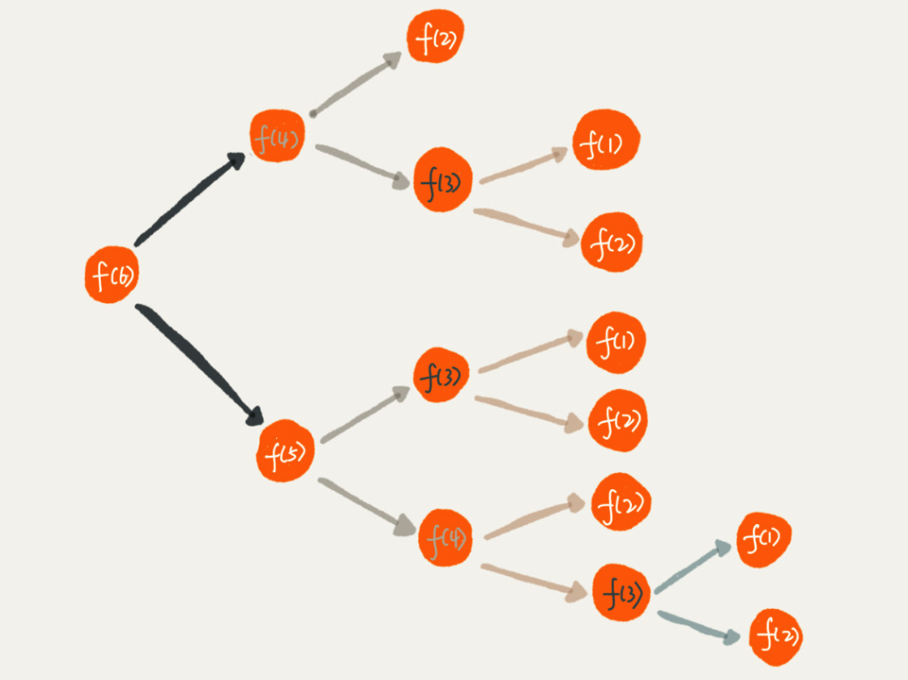

[TOC]

# 递归

## 什么是递归
**递归是一种算法. **  
举一个简单的例子说明递归  
假设你在电影院里面, 漆黑一片, 你想要直到自己在第几排, 那么你只需要知道你自己前面一排的人的排数 + 1, 而前一排的人也可以询问再前一排的人 + 1, 直到第一排的人为止.   

```java
int f(int n) {
		if (n == 1){
				return 1;
		}
		return f(n-1) + 1;
}
```

### 递归的要素:

1. 递归的终止条件
2. 每次递归重复的操作
**总结:** 写出递推公式，找到终止条件. 
写递归代码的关键就是找到如何将大问题分解为小问题的规律，并且基于此写出递推公式，然后再推敲终止条件，最后将递推公式和终止条件翻译成代码。

### 面对递归问题如何思考
很多时候我们面对问题, 不知道如何用递归的方法解决. 思考的时候很容易迷失在递和归中.

1. 如果一个问题A可以分解为B,C,D, 你可以假设B,C,D已经解决. 此时只需要想清楚A和B,C,D的关系, 类似于电影院问题中的 `f(n) = f(n-1) + 1`
2. 如果递推公式已经出来了, 还需要确认问题A的终止条件, 类似于电影问题中的 `f(1) = 1`

## 递归的问题
### 如何防止堆栈溢出
在栈的那一节提到过, 函数调用会被压入栈中保存临时变量. 等函数执行完毕之后, 才将变量和结果出栈. 所以当递归的规模很大的时候, 栈的内存很有可能会不够而导致栈溢出. 

### 如何防止递归的重复计算
台阶问题: 从第一层上到第六层, 每一次你都有俩个选择, 上一阶 或者 上二阶. 问:上到六阶有多少中上法.

1. 思考这个问题可以站在第五阶思考可以从第五阶, 也可以从第四阶, 这俩种方式到顶. `f(n) = f(n-1) + f(n-2)`
2. 此时需要思考递归的总结: 上到一层只有一种方式`f(1) = 1`, 上到二层可以有俩种方式`f(2) = 2`
```java
int f(int n) {
		if (n == 1) return 1;
		if (n == 2) return 2;
		return f(n-1) + f(n-2);
}
```
如图所示

从图中我们可以看到想要f(6), 需要f(5)和f(4). 想要f(5), 需要f(4)和f(3).  f(4)被计算了俩次, 解决这个问题可以将已经求求过的值保存起来就好了.

```java
int f(int n) {
		if (n == 1) return 1;
		if (n == 2) return 2;
		
		//是否已经计算过
		if (hasSolvedList.contain(n)) {
				return hasSolvedList.get(n);
		}
		//保存计算结果
		int temp = f(n-1) + f(n-2)
		hasSolvedList.put(n, temp)
		return temp;
}
```

### 其他问题
空间复杂度: 由于函数的递归调用, 所以函数的临时变量会被保存到栈中, 电影问题的空间复杂度为O(n)
时间复杂度: 由于函数的递归调用, 就电影院问题, 时间复杂度也为O(n) 

### 总结
递归本身就是借助栈来实现的, 只不过是系统或虚拟机提供的栈.   

## 如何通过递归找到最终推荐人
数据库中的表可能是这个样子的  

| actor_id  | referrer_id |
| ------------- | ------------- |
| A  | null  |
| B  | A  |
| C  | B  |
```java
long findRootReferrerId(long actorId) {
  Long referrerId = select referrer_id from [table] where actor_id = actorId;
  if (referrerId == null) return actorId;
  return findRootReferrerId(referrerId);
}
```
### 潜在问题:

1. 如果递归很深会有堆栈溢出问题  
2. 如果数据库中有脏数据, 可能会发生死循环, 同样会有堆栈溢出问题, 如果测试人员编写的数据为 
| actor_id  | referrer_id |
| ------------- | ------------- |
| A  | B  |
| B  | A  |
则会出现死循环  
**解决办法:** 可以考虑 `int count` 每次递归一次 `++count` 如果 `count > 100` 则跳出递归

这种方式只是部分防备了栈溢出, 栈的溢出主要因素是栈的内存不足. 所以count的值如果太大比方说10000, 很可能还没有到达10000, 栈已经溢出了, 而我们也没有很好的办法确认count的值为多少, 不会导致栈的溢出, 毕竟栈内存的大小在程序运行的时候是动态变化的, 所以这个解决办法比较适用于 count 被设置50 这种比较小的值. 

## 俩层递归的打印顺序
```swift
    func showZoreOneByTwoRecursion(_ n: Int) -> [String] {
        var result = [String]()
        dfs(n, &result, "" , 0)
        return result
    }
    func dfs(_ n: Int,
             _ result: inout [String],
             _ sub: String,
             _ level: Int) {
        if level == n {
            result.append(sub)
            return
        }
        generateParenthesis3dfs(n, &result ,sub + "0", level+1)
        generateParenthesis3dfs(n, &result ,sub + "1", level+1)
    }
```
```swift
print(showZoreOneByTwoRecursion(3))
output: ["000", "001", "010", "011", "100", "101", "110", "111"]
```

## 对于递归的代码如何调试
1.打印日志发现，递归值。
2.结合条件断点进行调试

## 参考地址
[递归 -- 数据结构与算法之美](https://time.geekbang.org/column/article/41440)


