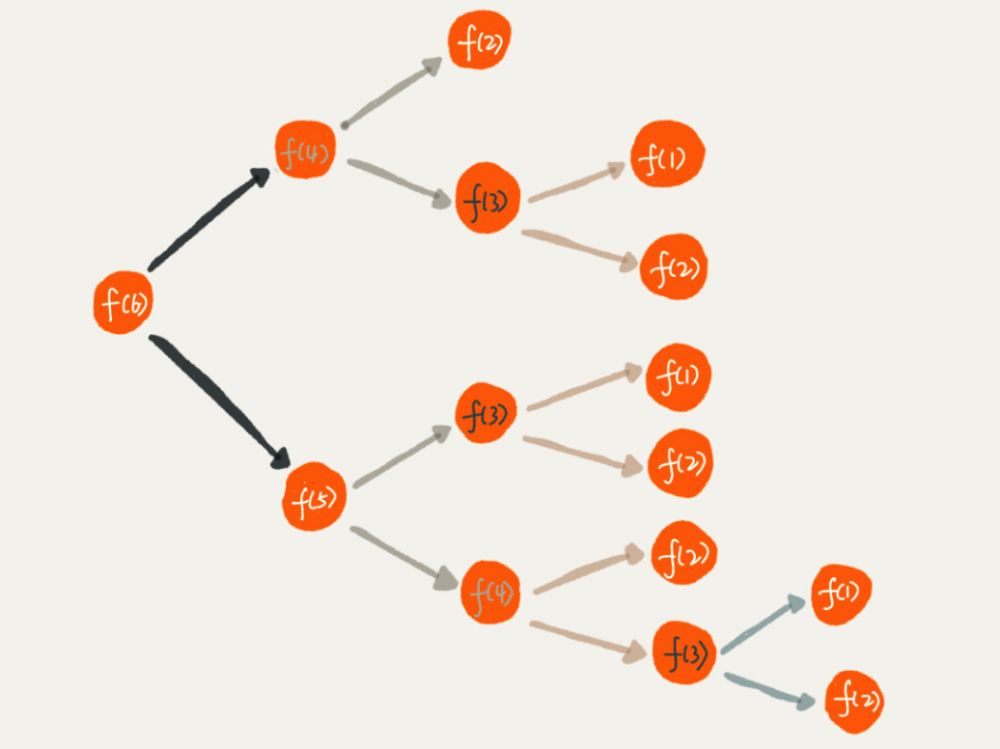

[TOC]

# 学习笔记
## 每日一题
### 239-滑动窗口最大值
这道题目考察对 堆 的使用, java的解决办法可以使用内置的优先队列, 当然也可以使用 双端队列
遍历数组:   
1. index >= k的时候需要注意, 最大值是否被移出
2. 有新的数据加入的时候, 确保堆顶 或者 双端队列的first是最大值
3. 在数据 index >= k-1的时候就可以从堆中或者双端队列的first取值了
[每日一题-239-滑动窗口最大值.md](./每日一题-239-滑动窗口最大值.md)

## M68-二叉树的最近公共父节点
1. 处理二叉树
2. 寻找俩个节点的最近(深度最深)相同的父节点
3. 树中所有节点的值是唯一的
4. p、q 为不同节点且均存在于给定的二叉树中
5. p 或 q本身可以成为最近父节点
这就标识肯定有结果, 使用递归的方式遍历树, 遇到p,q则返回p,q, 不在深入下去, 接着处理一下递归的结果, 如果左右都不为空, 则找到了父节点.  
[每日一题-M68-二叉树的最近公共父节点.md](./每日一题-M68-二叉树的最近公共父节点.md)

## 297- 二叉树的序列化与反序列化
1. 序列化的时候, 使用前序的方式遍历链表, 并且保存到字符串中.  
2. 已","号分割, 已"X"衔接再叶子节点尾部, 标识叶子节点  
3. 反序列化的时候, 将字符串转换为数组, 从数组首部取数据, 第一个就是根节点, 这个时候, 就体现出来了前序遍历的好处了
4. 接着按照前序的方式, 反序列化二叉树
[每日一题-297-二叉树的序列化与反序列化.md](./每日一题-297-二叉树的序列化与反序列化.md)

## 200- 岛屿数量
这道题可以使用 递归的方式, 也可以使用 迭代的方式完成. 递归的话使用的是系统的栈, dfs的方式将1 标记为 0, 迭代的话使用while循环+queue完成标记.
[每日一题-200-岛屿数量.md](./每日一题-200-岛屿数量.md)

## Pow(x,N)
分治思想例题
观察数学表达式当x=3,N=6, 3*3*3*3*3*3 = 3*3*3 * 3*3*3, 所以求3的6次幂, 可以分解为求 3的3次幂, 如此分治下去就最后当N=1的时候就可以直接求解了. 
不过还有特殊情况需要解决, n为负数的时候, 可以这样解决 x = 1/x, n = abs(n)
[每日一题-50-Pow(x, n).md](./每日一题-50-Pow(x, n).md)

## N皇后
回溯思想例题
问题描述: n 皇后问题研究的是如何将 n 个皇后放置在 n×n 的棋盘上，并且使皇后彼此之间不能相互攻击, 皇后的攻击范围是: 自身所在的横 竖 撇 捺  
解决思路: 皇后一行一行的放, 默认均从左到右检测是否能放皇后, 如果这一行有可以放置的位置, 则放下皇后, 如果到行尾了还没有位置, 则回溯到上一行, 将皇后放在下一个可行的位置
[每日一题-51-N皇后.md](./每日一题-51-N皇后.md)

## 子集
一个`不含重复元素`的数组, 返回其所有可能的子集  
非常适合使用一下代码, 回溯出所有子集  
```java
    public List<List<Integer>> subsets(int[] nums) {
        List<List<Integer>> list = new ArrayList<>();
        Arrays.sort(nums);
        backtrack(list, new ArrayList<>(), nums, 0);
        return list;
    }
    //[[],[1],[1,2],[1,2,3],[1,3],[2],[2,3],[3]]
    //[0,0,0]第一层dg 第二层dg 第三层dg
    //       [1,0,0],[1,1,0],[1,1,1]
    //               [1,0,1]
    //       [0,1,0],[0,1,1]
    //       [0,0,1]
    private void backtrack(List<List<Integer>> list , List<Integer> tempList, int [] nums, int start){
        list.add(new ArrayList<>(tempList));
        for(int i = start; i < nums.length; i++){
            tempList.add(nums[i]);
            backtrack(list, tempList, nums, i + 1);
            tempList.remove(tempList.size() - 1);
        }
    }
```
### 子集的类似题目集合
[每日一题-78-子集.md](./每日一题-78-子集.md)
[每日一题-77-组合.md](./每日一题-77-组合.md)
[每日一题-90-子集 II.md](./每日一题-90-子集 II.md)
[每日一题-47-全排列 II.md](./每日一题-47-全排列 II.md)
[每日一题-46-全排列.md](./每日一题-46-全排列.md)

## 递归
**递归是一种算法. **  
举一个简单的例子说明递归  
假设你在电影院里面, 漆黑一片, 你想要直到自己在第几排, 那么你只需要知道你自己前面一排的人的排数 + 1, 而前一排的人也可以询问再前一排的人 + 1, 直到第一排的人为止.   

```java
int f(int n) {
		if (n == 1){
				return 1;
		}
		return f(n-1) + 1;
}
```

### 递归的要素:

1. 递归的终止条件
2. 每次递归重复的操作
**总结:** 写出递推公式，找到终止条件. 
写递归代码的关键就是找到如何将大问题分解为小问题的规律，并且基于此写出递推公式，然后再推敲终止条件，最后将递推公式和终止条件翻译成代码。

### 面对递归问题如何思考
很多时候我们面对问题, 不知道如何用递归的方法解决. 思考的时候很容易迷失在递和归中.

1. 如果一个问题A可以分解为B,C,D, 你可以假设B,C,D已经解决. 此时只需要想清楚A和B,C,D的关系, 类似于电影院问题中的 `f(n) = f(n-1) + 1`
2. 如果递推公式已经出来了, 还需要确认问题A的终止条件, 类似于电影问题中的 `f(1) = 1`

## 递归的问题
### 如何防止堆栈溢出
在栈的那一节提到过, 函数调用会被压入栈中保存临时变量. 等函数执行完毕之后, 才将变量和结果出栈. 所以当递归的规模很大的时候, 栈的内存很有可能会不够而导致栈溢出. 

### 如何防止递归的重复计算
台阶问题: 从第一层上到第六层, 每一次你都有俩个选择, 上一阶 或者 上二阶. 问:上到六阶有多少中上法.

1. 思考这个问题可以站在第五阶思考可以从第五阶, 也可以从第四阶, 这俩种方式到顶. `f(n) = f(n-1) + f(n-2)`
2. 此时需要思考递归的总结: 上到一层只有一种方式`f(1) = 1`, 上到二层可以有俩种方式`f(2) = 2`
```java
int f(int n) {
		if (n == 1) return 1;
		if (n == 2) return 2;
		return f(n-1) + f(n-2);
}
```
如图所示

从图中我们可以看到想要f(6), 需要f(5)和f(4). 想要f(5), 需要f(4)和f(3).  f(4)被计算了俩次, 解决这个问题可以将已经求求过的值保存起来就好了.

```java
int f(int n) {
		if (n == 1) return 1;
		if (n == 2) return 2;
		
		//是否已经计算过
		if (hasSolvedList.contain(n)) {
				return hasSolvedList.get(n);
		}
		//保存计算结果
		int temp = f(n-1) + f(n-2)
		hasSolvedList.put(n, temp)
		return temp;
}
```

### 其他问题
空间复杂度: 由于函数的递归调用, 所以函数的临时变量会被保存到栈中, 电影问题的空间复杂度为O(n)
时间复杂度: 由于函数的递归调用, 就电影院问题, 时间复杂度也为O(n) 

### 总结
递归本身就是借助栈来实现的, 只不过是系统或虚拟机提供的栈. 
### 更多
[更多](./递归)

## 分治思想- 分而治之
分治的思想就是将原来的问题划分成 n 个规模较小, 并且结构与原问题相似的子问题, 递归的解决子问题, 再将其结果合并, 就得到原问题的解.   
`分治算法是一个处理问题的思想, 递归是一种编程技巧`
分治算法一般都适合用递归来实现, 递推公式一半包含: 
* 分解: 将原问题分解成一系列子问题
* 解决:  解决子问题 (如果问题足够小,可直接求解,例如Pow(x),)
* 合并: 将子问题的结果合并成原问题 ( mergeSort的子问题合并)

### 分治算法适用的前提
1. 原问题与分解成的小问题具有相同的模式
2. 原问题分解成的子问题可以独立求解
3. 具有分解终止条件, 当问题足够小的时候, 可以直接求解
4. 可以将子问题合并成原问题, 合并操作的复杂度不宜太高, 否则起不到简化的效果了

## 应用举例
### 求出一组数据的逆序对个数
**暴力方法** 按照数组的顺序, 拿数组的元素同之后的元素对比, 如果比后面的元素大, 逆序对个数+1
```C
总共需要对比的次数 = n-1 + n-2 + n-3 + .... 1 = n*(n-1) / 2
所以时间复杂度为 O(N*N)
```

**归并排序** 会先将数组划分为单个元素, 再对比大小合并单个元素, 合并的时候就可以查看数组的逆序度了

### 分治思想在海量数据处理种的应用
之前大部分的问题都是内存存储和单机处理, 但是对于海量的数据, 没有办法一次性放到内存中, 这个时候可以使用分治的思想, 将海量数据划分为一个个子问题, 这个时候就可以放到内存一一解决, 再合并得到最终解了  
例如: 有10GB的订单文件需要按照金额排序   
1. 遍历订单, 并且将订单按照1~100元, 100~200元.. 合理的区间, 将数据划分到10个区间中
2. 再将每个区间的订单加载到内存中, 使用快排排序,得到单个区间的有序结果
3. 最后将这10个区间, 按区间顺序合并, 得到最终的结果
**利用分治的思想可以最大限度的发挥多机优势, 或者多线程优势, 毕竟有多余的机力, 为什么不充分利用呢**

### 现实生活中分治思想的使用
1. 国家统计人口时候, 可以将任务分配给每个省, 每个省可以将任务分配到每个市,再分配到每个区,分配到街道, 当子问题很小的时候开始解决子问题, 最后逐级上报
2. 全年级考试需要排名, 可以先让班班将自己的班级排好, 再将各个班的结果合并为总年级排序
3. 一年的kpi为M个销售额, 可以将M先划分到每个月, 再划分到每周, 每天, 最后一年下来就完成目标了
### 更多
[更多](./分治)

## 回溯思想
枚举所有的解, 找到满足期望的解. 再枚举所有解的过程分为很多阶段, 每个阶段有很多岔路口, 我们任意选择一个路口, 走下去, 如果发现走不通, 就退回到上一个岔路口, 选择另一个路口, 如此往复. 

## 经典案例
### 正则表达式匹配问题
简易版本的正则表达式: 只支持`*` 和 `?`俩种通配符  
简易版本的`*` 支持匹配0 - 任意个字符  
简易版本的`?` 支持匹配0 个或者1个字符  

```java
class OperationPattern{
    public static void main(String[] args) {
        Pattern p = new Pattern("*?",2);
        System.out.println(p.match("sfefefe"));

    }
}

public class Pattern {
    private boolean isMatch = false;
    private char[] pattern;
    private int pl;

    public Pattern(String pattern, int pl) {
        this.pattern = pattern.toCharArray();
        this.pl = pl;
    }
    public Pattern(char[] pattern, int pl) {
        this.pattern = pattern;
        this.pl = pl;
    }

    public boolean match(String target) {
        matchHS(0,0,target.toCharArray(),target.length());
        return isMatch;
    }

    //字符串 和 正则都匹配完 完成对比
    public void matchHS(int pi,int ti,char[] targets,int targetLength) {
        //如果已经匹配了, 就不需要继续递归了
        if (isMatch) {return;}
        //终止条件, 先判断正则是否到达极值
        if (pi == pl) {
            if (ti == targetLength) { isMatch = true; }
            return;
        }

        //递归, 回溯, 选择岔路口
        if (pattern[pi] == '*') {
            for (int i = 0; i <= targets.length - ti; i++) {
                matchHS(pi+1,ti+i,targets,targetLength);
            }
        } else if (pattern[pi] == '?') {
            matchHS(pi+1,ti,targets,targetLength);
            matchHS(pi+1,ti+1,targets,targetLength);
        } else if (ti < targetLength && pattern[pi] == targets[ti]) {
            matchHS(pi+1,ti+1,targets,targetLength);
        }
    }
}
```

## Sqrt(x):牛顿迭代法和Quake-III中的神奇方法
```C
int mysqrt(int x){
	double tmpx = x;
	double k = 1.0;
	double k0 = 0.0;
	while(abs(k0-k) >= 1){
		k0 = k;
		k = (k + tmpx/k)/2;
	}
	return (int)k;
}
```

下面再贴一下Quake-III中的神奇解法
```C
int mysqrt(int x){
	float tmpx = (float)x;
	float xhalf = 0.5f*tmpx;
	int i = *(int*)&tmpx;
	i = 0x5f375a86 - (i >> 1);
	tmpx = *(float*) & i;
	tmpx = tmpx * (1.5f - xhalf*tmpx*tmpx);
	tmpx = tmpx * (1.5f - xhalf*tmpx*tmpx);


	int res = (int)(1.0/tmpx);
	if((res+1) * (res + 1) <= x)
		res += 1;
	return res;
}
```

[牛顿迭代法快速寻找平方根](http://www.matrix67.com/blog/archives/361)