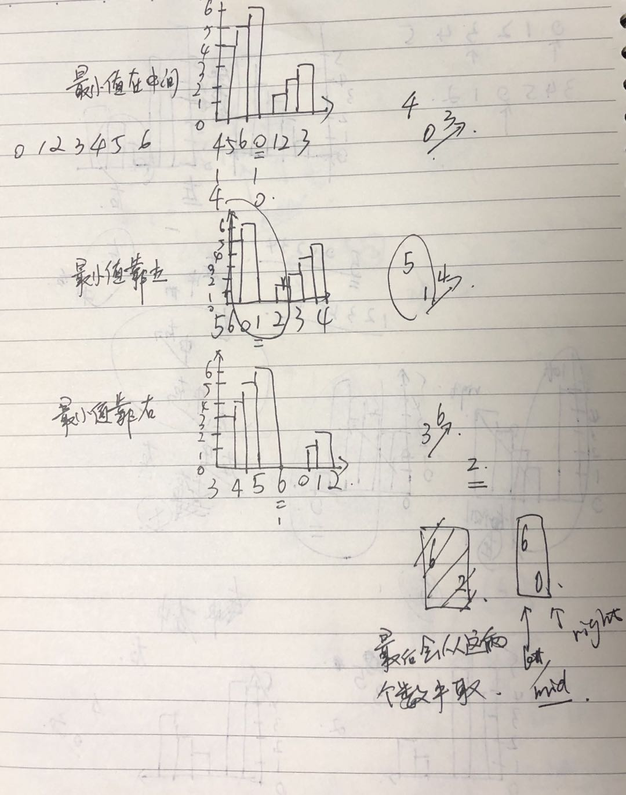

[TOC]

# 每日一题-寻找旋转排序数组中的最小值

## 题目
假设按照升序排序的数组在预先未知的某个点上进行了旋转。  
( 例如，数组 [0,1,2,4,5,6,7] 可能变为 [4,5,6,7,0,1,2] )。  
请找出其中最小的元素。  
你可以假设数组中不存在重复元素。  
**示例:**  
```java
输入: [3,4,5,1,2]
输出: 1
```

### 读题所得
1. 数组中不存在重复元素
2. 有序数组但是旋转过一次,部分有序

## 分析各种情况
```C
          *
        *
      *
    *
  *
*
```
做了旋转  
```C
    *
  *
*
        *
      *
    *(找这个点)
```
二分查找的时候, 可能会发生三种情况  
情况1:

```C
  *
*
    *(找这个点)
```
情况2:
```C
*
    *
  *(找这个点)
```
情况3:

        *
      *
    *(找这个点)
## 方法一:自己得思路

```java
    public int findMin(int[] nums) {
        int start = 0; int end = nums.length - 1;
        while (start < end) {
            if (nums[start] < nums[end]) {
                return nums[start];
            }

            int mid = start + (end - start) / 2;
            if (nums[mid] >= nums[start]) {
                start = mid + 1;
            } else {
                end = mid;
            }
        }
        return nums[start];
    }
```
### 复杂度
* 时间复杂度: O(logN)
* 空间复杂度: O(1)

## 方法二: 参考解题

```swift
    func findMin(_ nums: [Int]) -> Int {
        var start = 0; var end = nums.count - 1
        while (start < end) {
            //中间偏左
            let mid = start + (end - start) / 2
            //最后剩俩个数的时候, 一定是这种情况
            //那么需要mid != end, 所以取中间偏左
            //mid > end的时候, 执行 `start = mid + 1` 最后跳出循环, 并且 start == end == 最小值
            if nums[mid] < nums[end] {
                end = mid
            } else {
                start = mid + 1
                
            }
        }
        return nums[start]
    }
```


写法二:   `nums[mid] > nums[right]`

```java
    public int findMin(int[] nums) {
        int left = 0, right = nums.length - 1;
        while (left < right) {
            int mid = left + (right - left) / 2;
            if (nums[mid] > nums[right]) {
                left = mid + 1;
            } else {
                right = mid;
            }
        }
        return nums[left];
    }
```


### 复杂度

* 时间复杂度: O(logN)
* 空间复杂度: O(1)

## 测试用例
[5,1,2,3,4]  

## leetcode链接
[leetcode链接题目链接](https://leetcode-cn.com/problems/find-minimum-in-rotated-sorted-array/)   