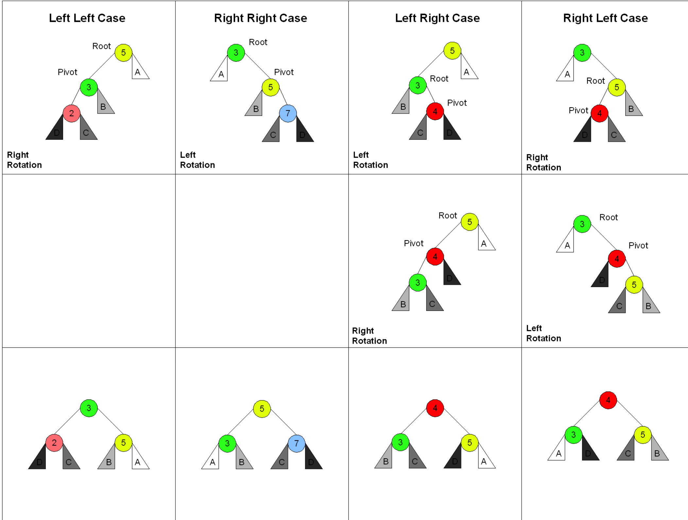

[TOC]
# 学习笔记
## 每日一题
### 每日一题-547-朋友圈
二维数组很自然的可以联想到图 , 所以可以尝试使用 DFS  
根据题意 `已知 A 是 B 的朋友，B 是 C 的朋友，那么我们可以认为 A 也是 C 的朋友` 可以联想到使用并查集解决该问题  
[每日一题-547-朋友圈.md](./每日一题-547-朋友圈.md)  

###  每日一题-130-被围绕的区域
bfs 递归。可以想想二叉树中如何递归的进行层序遍历。  
bfs 非递归。一般用队列存储。(Queue)  
dfs 递归。最常用，如二叉树的先序遍历。  
dfs 非递归。一般用 stack。(Stack)  
[每日一题-130-被围绕的区域.md](./每日一题-130-被围绕的区域.md)  
[对BFS&DFS的代码实现](https://leetcode-cn.com/problems/surrounded-regions/solution/bfsdi-gui-dfsfei-di-gui-dfsbing-cha-ji-by-ac_pipe/)

### 括号生成: DP
```java
    public List<String> generateParenthesis(int n) {
        //value 标识 n=index的时候可以生成的所有括号的可能性
        List<List<String>> dp = new ArrayList<>();
        if (n < 1) { return dp.get(0); }
        //base case
        List<String> dp0 = new ArrayList<>(1);
        dp0.add("");
        List<String> dp1 = new ArrayList<>(1);
        dp1.add("()");
        dp.add(dp0); dp.add(dp1);

        for (int count = 2; count <= n; count++) {
            List<String> newSub = new ArrayList<>();
            for (int left = 0; left < count; left++) {
                //left + right + 1 = count
                //left + right少1,少的那个1就是待增加的括号, 通过left部分的移动组合所有的可能性
                int right = count - left - 1;
                List<String> sub1 = dp.get(left);
                List<String> sub2 = dp.get(right);
                for(String s1 : sub1) {
                    for(String s2: sub2) {
                        String newP = "(" + s1 + ")" + s2;
                        newSub.add(newP);
                    }
                }
            }
            dp.add(newSub);
        }
        return dp.get(n);
    }
```
#### 复杂度
* 时间复杂度: 等于括号的所有可能性 O(3*N) ->O(N)
* 空间复杂度: 等于括号的所有可能性 O(3*N) ->O(N)

## 方法三: bfs-双向优化
1. 先扫描字典, 使用'*'变异出所有可能的变异 
2. 双向搜索
3. HashSet可以将查询的速度提高到O(1)
4. 开始BFS按层变异
5. key 为pre value 为对应的next `Map<String,List<String>> tree = new HashMap<>()`

```java
    public List<List<String>> findLadders5(String beginWord, String endWord, List<String> wordList) {
        List<List<String>> res = new ArrayList<>();
        if (!wordList.contains(endWord)) {return res;}

        Map<String,List<String>> map = new HashMap<>();
        for(String word : wordList) {
            char[] chars = word.toCharArray();
            for (int i = 0; i < chars.length; i++) {
                char old = chars[i];
                chars[i] = '*';
                String key = new String(chars);
                List<String> words = map.getOrDefault(key,new ArrayList<>());
                words.add(word);
                map.put(key,words);
                chars[i] = old;
            }
        }

        Set<String> beginSet = new HashSet<>();
        Set<String> endSet = new HashSet<>();
        Set<String> visited = new HashSet<>();
        beginSet.add(beginWord); endSet.add(endWord);
        visited.add(beginWord); visited.add(endWord);
        //key 为pre value 为对应的next
        Map<String,List<String>> tree = new HashMap<>();

        boolean isBegin = true;
        boolean isFond = false;
        while (!beginSet.isEmpty() && !isFond) {
            Set<String> temp = new HashSet<>();
            Set<String> tempVisited = new HashSet<>();
            for (String word : beginSet) {
                char[] chars = word.toCharArray();
                for (int i = 0; i < chars.length; i++) {
                    char old = chars[i];
                    chars[i] = '*';
                    String newWord = new String(chars);
                    List<String> words = map.getOrDefault(newWord, new ArrayList<>());
                    for (String w : words) {
                        //查看是否找到
                        if (endSet.contains(w)) {
                            if (isBegin) {
                                List<String> strings = tree.getOrDefault(word, new ArrayList<>());
                                strings.add(w);
                                tree.put(word,strings);
                            } else {
                                List<String> strings = tree.getOrDefault(w, new ArrayList<>());
                                strings.add(word);
                                tree.put(w,strings);
                            }

                            isFond = true;
                        }

                        //继续变异
                        if (!visited.contains(w) && !isFond){
                            tempVisited.add(w);
                            temp.add(w);
                            if (isBegin) {
                                List<String> strings = tree.getOrDefault(word, new ArrayList<>());
                                strings.add(w);
                                tree.put(word,strings);
                            } else {
                                List<String> strings = tree.getOrDefault(w, new ArrayList<>());
                                strings.add(word);
                                tree.put(w,strings);
                            }
                        }
                    }
                    chars[i] = old;
                }
            }
            
            if (isFond) {
                List<String> sub = new ArrayList<>();
                sub.add(beginWord);
                addSubResult(res,sub,tree,beginWord,endWord);
                return res;
            }

            beginSet = temp;
            visited.addAll(tempVisited);

            if (beginSet.size() > endSet.size()) {
                Set<String> t = beginSet;
                beginSet = endSet;
                endSet = t;
                isBegin = !isBegin;
            }
        }
        return res;
    }
    private void addSubResult(List<List<String>> res,List<String> sub,Map<String,List<String>> map,String beginWord,String endWord) {
        if (beginWord.equals(endWord)) {

            res.add(new ArrayList<>(sub));
            return;
        }
        // 得到所有的下一个的节点
        List<String> neighbors = map.getOrDefault(beginWord, new ArrayList<String>());
        for (String neighbor : neighbors) {
            sub.add(neighbor);
            addSubResult(res,sub,map,neighbor,endWord);
            sub.remove(sub.size() - 1);
        }
    }
```

### 每日一题-773-滑动谜题

```java

```

## 并查集
解决图论中「动态连通性」问题的  
这里所说的「连通」是一种等价关系，也就是说具有如下三个性质：  
1、自反性：节点p和p是连通的。  
2、对称性：如果节点p和q连通，那么q和p也连通。  
3、传递性：如果节点p和q连通，q和r连通，那么p和r也连通。  

[labuladong](https://leetcode-cn.com/problems/friend-circles/solution/union-find-suan-fa-xiang-jie-by-labuladong/)

## 启发式搜索- A*
A* 搜索: 相交于BFS每次按层逐个搜索, A* 搜索根据估价函数, 确定先搜索的节点效率更高  
所以好的A* 搜索的关键在于 `估价函数` 设计的是否合理, 否则可能退化为BFS搜索  

### 二维网格-相似度测量方法
[相似度测量方法](https://dataaspirant.com/2015/04/11/five-most-popular-similarity-measures-implementation-in-python/)

## 平衡二叉树
对比散列表的时候, 提到了平衡二叉树.  因为二叉查找树在频繁的插入、删除等动态更新的情况下，极端情况会出现时间复杂度退化为O(N)的问题,  在二叉搜索树的基础上加上一个平衡因子 ,就是平衡二叉树, 平衡二叉树让数据的插入, 删除, 查找时间复杂度更稳定  

### AVL树
一棵**严格**平衡的二叉搜索树  
**平衡因子(node) ** = Height(RightSubtree(node)) - Height(LeftSubtree(node))  
**平衡因子 的范围 {-1,0,1} **  
  

**平衡(Rebalancing) **   
1. 左旋 左旋  
2. 右旋 右旋
3. 左旋 右旋
4. 右旋 左旋

  

### 红黑树
一棵**相对**平衡的二叉搜索树   
**平衡因子(node) ** = Height(RightSubtree(node)) - Height(LeftSubtree(node))  
**平衡因子 的范围  **  Height(RightSubtree(node)) <= Height(LeftSubtree(node)) * 2 - Height(RightSubtree(node))

**红黑树的特性**
1. 结点不是黑就是白
2. 根是黑色的。 有时会忽略此规则。 由于根始终可以从红色更改为黑色，但不一定反之亦然，因此该规则对分析的影响很小。
3. 所有的叶子结点都是`NIL` 且为黑色
4. 如果一个结点是红色, 那么它的子节点均为黑色 (不能有相邻的结点同时为红色)
5. 从给定节点到其任何后代NIL节点的每条路径都经过相同数量的黑色节点。


### AVL 对比 红黑树
**AVL 优势** 由于是一棵**严格**平衡的二叉搜索树, 所以`查询`的速度很快
**AVL 劣势** 
1. 也是由于**严格** 造成维护的成本很高, 所以`插入` `删除` 的速度相较于`红黑树`会慢些
2. 也是由于**严格**需要记录 平衡因子 的空间成本较 `红黑树` 会高些

**红黑树 优势**  
1. 由于是一棵**相对**平衡的二叉搜索树, 所以`插入` `删除` 的速度相较于`AVL树`会快些
2. 需要记录 平衡因子 的空间成本较 基本可以忽略, 仅需要 1bit
**AVL 劣势**  由于是一棵**相对**平衡的二叉搜索树, 所以`查找` 的速度相较于`AVL树`会慢些

## 动态的数据结构
`散列表`：插入删除查找都是O(1), 是最常用的，但其缺点是不能顺序遍历以及扩容缩容的性能损耗。适用于那些不需要顺序遍历，数据更新不那么频繁的。

`跳表`：插入删除查找都是O(logn), 并且能顺序遍历。缺点是空间复杂度O(n)。适用于不那么在意内存空间的，其顺序遍历和区间查找非常方便。

`红黑树`：插入删除查找都是O(logn), 中序遍历即是顺序遍历，稳定。缺点是难以实现，去查找不方便。其实跳表更佳，但红黑树已经用于很多地方了。